# 🎧 EchoSense - Audio Intelligence Platform

<div align="center">
  
  
  
  [](https://www.python.org/)
  [](https://streamlit.io/)
  [](https://www.assemblyai.com/)
  [](LICENSE)
  [](https://github.com/yourusername/echosense)
  
  **Transform audio into actionable intelligence with cutting-edge AI**

  [Demo](#-demo) • [Features](#-features) • [Installation](#-installation) • [Usage](#-usage) • [API](#-api) • [Contributing](#-contributing)

</div>

---

## 🌟 Overview

EchoSense is a powerful audio intelligence platform that leverages AssemblyAI's state-of-the-art models to transform audio content into valuable insights. Built with Streamlit for an intuitive web interface and MCP server for API access, it provides comprehensive audio analysis including transcription, speaker diarization, sentiment analysis, topic detection, and AI-powered Q&A.

## 🏗️ Architecture


## 🚀 Features

### Core Capabilities

| Feature | Description | Technology |
|---------|-------------|------------|
| 🎯 **Smart Transcription** | Industry-leading accuracy with precise timestamps | AssemblyAI Core |
| 👥 **Speaker Diarization** | Identify and separate up to 10 speakers | Voice Fingerprinting |
| 😊 **Sentiment Analysis** | Detect emotions and conversation dynamics | NLP Models |
| 📋 **Intelligent Summary** | AI-powered key insights extraction | LeMUR AI |
| 🏷️ **Topic Modeling** | Categorization across 700+ IAB categories | Topic Detection |
| 💬 **Interactive Q&A** | Chat with your audio using Claude 3.5 Sonnet | LeMUR Integration |
| 🌐 **Multi-Language** | Support for 100+ languages | Auto-Detection |
| 📊 **Analytics Dashboard** | Visual insights with Plotly charts | Data Visualization |

### Processing Flow


## 📦 Installation

### Prerequisites

- Python 3.8 or higher
- AssemblyAI API key ([Get one here](https://www.assemblyai.com/))
- 2GB RAM minimum
- Modern web browser

### Quick Start

1. **Clone the repository**
```bash
git clone https://github.com/yourusername/echosense.git
cd echosense
```

2. **Install dependencies**
```bash
pip install -r requirements.txt
```

3. **Set up environment variables**
```bash
# Create .env file
echo "ASSEMBLYAI_API_KEY=your_api_key_here" > .env
```

4. **Run the application**
```bash
# Start Streamlit app
streamlit run app.py

# Or start MCP server
python server.py
```

## 🎮 Usage

### Web Interface

1. **Upload Audio**: Click the upload button in the sidebar
2. **Configure Settings**: Adjust speaker count and analysis options
3. **Process**: Wait for AI analysis (typically 30-60 seconds)
4. **Explore Results**: Navigate through tabs for different insights
5. **Ask Questions**: Use the AI chat for specific queries
6. **Export**: Download results in JSON, CSV, or TXT format

### MCP Server API

```python
from mcp.client import Client

# Initialize client
client = Client("localhost:8080")

# Transcribe audio
result = client.transcribe_audio("path/to/audio.mp3")

# Get specific features
data = client.get_audio_data(
    text=True,
    speakers=True,
    sentiment=True,
    summary=True
)
```

## 📊 Data Flow Diagram

```mermaid
graph LR
    subgraph Input
        A1[WAV] --> B[Audio Processing]
        A2[MP3] --> B
        A3[MP4] --> B
        A4[M4A] --> B
        A5[FLAC] --> B
    end
    
    subgraph Analysis
        B --> C{AssemblyAI Pipeline}
        C --> D[Transcription Engine]
        C --> E[Speaker Detection]
        C --> F[Sentiment Model]
        C --> G[Topic Classifier]
        C --> H[Summarization]
    end
    
    subgraph Intelligence
        D --> I[Timestamped Text]
        E --> J[Speaker Segments]
        F --> K[Emotion Scores]
        G --> L[IAB Categories]
        H --> M[Key Points]
    end
    
    subgraph Output
        I --> N[Searchable Transcript]
        J --> O[Speaker Analytics]
        K --> P[Sentiment Charts]
        L --> Q[Topic Distribution]
        M --> R[Executive Summary]
        N & O & P & Q & R --> S[💾 Export]
    end
    
    style C fill:#00d4ff
    style S fill:#4caf50
```



## 🛠️ Configuration

### Audio Processing Options

```python
config = aai.TranscriptionConfig(
    speaker_labels=True,        # Enable speaker diarization
    speakers_expected=2,         # Number of expected speakers
    iab_categories=True,         # Topic detection
    sentiment_analysis=True,     # Emotion analysis
    summarization=True,          # Auto-summarization
    language_detection=True,     # Auto-detect language
)
```

### Supported Formats

| Format | Extension | Max Size | Quality |
|--------|-----------|----------|---------|
| WAV | .wav | 5GB | Lossless |
| MP3 | .mp3 | 500MB | High |
| MP4 | .mp4 | 500MB | High |
| M4A | .m4a | 500MB | High |
| FLAC | .flac | 5GB | Lossless |
| AAC | .aac | 500MB | High |
| OGG | .ogg | 500MB | High |

## 📈 Performance Metrics

- **Transcription Accuracy**: 95%+ for clear audio
- **Processing Speed**: ~30 seconds per 5-minute audio
- **Language Support**: 100+ languages
- **Speaker Detection**: Up to 10 speakers
- **Concurrent Users**: 50+ (with proper deployment)

## 🎨 Screenshots

<div align="center">
  
### Main Dashboard


### Analysis Results


### AI Chat Interface


</div>

## 🤝 Contributing

We welcome contributions! Please see our [Contributing Guidelines](CONTRIBUTING.md) for details.

1. Fork the repository
2. Create your feature branch (`git checkout -b feature/AmazingFeature`)
3. Commit your changes (`git commit -m 'Add some AmazingFeature'`)
4. Push to the branch (`git push origin feature/AmazingFeature`)
5. Open a Pull Request

## 📜 License

This project is licensed under the MIT License - see the [LICENSE](LICENSE) file for details.

## 🙏 Acknowledgments

- [AssemblyAI](https://www.assemblyai.com/) for powerful speech recognition APIs
- [Streamlit](https://streamlit.io/) for the amazing web framework
- [Anthropic](https://www.anthropic.com/) for Claude AI integration
- [Plotly](https://plotly.com/) for interactive visualizations

## 📞 Support

- 📧 Email: support@echosense.ai
- 💬 Discord: [Join our community](https://discord.gg/echosense)
- 📖 Documentation: [docs.echosense.ai](https://docs.echosense.ai)
- 🐛 Issues: [GitHub Issues](https://github.com/yourusername/echosense/issues)

## 🚦 Status


---

<div align="center">
  
**Built with ❤️ by the EchoSense Team**

[⬆ Back to Top](#-echosense---audio-intelligence-platform)

</div>
