# EchoSense Architecture - Color Scheme Guide

## 🎨 Recommended Color Palette

### Primary Components

| Component | Hex Color | RGB | Usage |
|-----------|-----------|-----|-------|
| **Frontend Layer** | `#FF6B6B` | rgb(255, 107, 107) | Audio Input, Streamlit Web App |
| **Processing Pipeline** | `#4ECDC4` | rgb(78, 205, 196) | Audio Processing, AssemblyAI API |
| **Intelligence Features** | `#45B7D1` | rgb(69, 183, 209) | Core Analysis Features |
| **Output Layer** | `#96CEB4` | rgb(150, 206, 180) | Export Options, Results |
| **MCP Server** | `#DDA0DD` | rgb(221, 160, 221) | API Endpoints, Server |
| **Interactive UI** | `#FFD93D` | rgb(255, 217, 61) | User Interface Elements |

### Feature-Specific Colors

| Feature | Hex Color | RGB | Component |
|---------|-----------|-----|-----------|
| **Transcription** | `#6C5CE7` | rgb(108, 92, 231) | Text Processing |
| **Speaker Diarization** | `#00B894` | rgb(0, 184, 148) | Speaker Analysis |
| **Sentiment Analysis** | `#FDCB6E` | rgb(253, 203, 110) | Emotion Detection |
| **Topic Detection** | `#E17055` | rgb(225, 112, 85) | Category Classification |
| **Summarization** | `#74B9FF` | rgb(116, 185, 255) | Summary Generation |
| **AI Chat with LeMUR** | `#A29BFE` | rgb(162, 155, 254) | Interactive Q&A |

### Background & Accent Colors

| Element | Hex Color | RGB | Usage |
|---------|-----------|-----|-------|
| **Dark Background** | `#1E272E` | rgb(30, 39, 46) | Main canvas background |
| **Container Background** | `#2C3E50` | rgb(44, 62, 80) | Component containers |
| **Connection Lines** | `#95A5A6` | rgb(149, 165, 166) | Flow arrows |
| **Highlight/Active** | `#00D4FF` | rgb(0, 212, 255) | Active states, selections |
| **Success/Complete** | `#4CAF50` | rgb(76, 175, 80) | Successful operations |
| **Warning/Processing** | `#FFC107` | rgb(255, 193, 7) | In-progress states |

## 🎯 Implementation in Your Diagram

### CSS/Style Implementation

```css
/* Frontend Components */
.frontend-layer {
    background: linear-gradient(135deg, #FF6B6B, #FF8E53);
    color: white;
    border: 2px solid #FF6B6B;
    border-radius: 8px;
}

/* Processing Pipeline */
.processing-pipeline {
    background: linear-gradient(135deg, #4ECDC4, #44A08D);
    color: white;
    border: 2px solid #4ECDC4;
    border-radius: 8px;
}

/* Intelligence Features */
.intelligence-features {
    background: linear-gradient(135deg, #45B7D1, #2196F3);
    color: white;
    border: 2px solid #45B7D1;
    border-radius: 8px;
}

/* Output Layer */
.output-layer {
    background: linear-gradient(135deg, #96CEB4, #88D8B0);
    color: #2C3E50;
    border: 2px solid #96CEB4;
    border-radius: 8px;
}

/* MCP Server */
.mcp-server {
    background: linear-gradient(135deg, #DDA0DD, #B19CD9);
    color: white;
    border: 2px solid #DDA0DD;
    border-radius: 8px;
}
```

## 🔄 Updated Mermaid Diagram with Colors

```mermaid
graph TB
    subgraph FL["Frontend Layer"]
        A[🎧 Audio Input]:::frontend
        B[📱 Streamlit Web App]:::frontend
        C[🎨 Interactive UI]:::ui
    end
    
    subgraph PP["Processing Pipeline"]
        D[🔄 Audio Processing]:::processing
        E[🧠 AssemblyAI API]:::processing
        F[📊 Data Transformation]:::processing
    end
    
    subgraph IF["Intelligence Features"]
        G[📝 Transcription]:::transcription
        H[👥 Speaker Diarization]:::speaker
        I[😊 Sentiment Analysis]:::sentiment
        J[🏷️ Topic Detection]:::topic
        K[📋 Summarization]:::summary
        L[💬 AI Chat with LeMUR]:::chat
    end
    
    subgraph OL["Output Layer"]
        M[📤 Export Options]:::output
        N[🤖 Real-time Q&A]:::output
        O[JSON/CSV/TXT]:::export
    end
    
    subgraph MS["MCP Server"]
        P[🔌 MCP Server]:::mcp
        Q[API Endpoints]:::mcp
        R[External Integration]:::mcp
    end
    
    A --> B
    B --> C
    B --> D
    D --> E
    E --> F
    F --> G & H & I & J & K & L
    G & H & I & J & K --> M
    L --> N
    M --> O
    E --> P
    P --> Q
    Q --> R
    
    classDef frontend fill:#FF6B6B,stroke:#FF4757,color:#fff,stroke-width:2px
    classDef ui fill:#FFD93D,stroke:#FFA502,color:#2C3E50,stroke-width:2px
    classDef processing fill:#4ECDC4,stroke:#00B894,color:#fff,stroke-width:2px
    classDef transcription fill:#6C5CE7,stroke:#5F3DC4,color:#fff,stroke-width:2px
    classDef speaker fill:#00B894,stroke:#00856A,color:#fff,stroke-width:2px
    classDef sentiment fill:#FDCB6E,stroke:#F39C12,color:#2C3E50,stroke-width:2px
    classDef topic fill:#E17055,stroke:#D63031,color:#fff,stroke-width:2px
    classDef summary fill:#74B9FF,stroke:#0984E3,color:#fff,stroke-width:2px
    classDef chat fill:#A29BFE,stroke:#6C5CE7,color:#fff,stroke-width:2px
    classDef output fill:#96CEB4,stroke:#68B684,color:#2C3E50,stroke-width:2px
    classDef export fill:#DDD,stroke:#AAA,color:#2C3E50,stroke-width:2px
    classDef mcp fill:#DDA0DD,stroke:#B19CD9,color:#fff,stroke-width:2px
```



## 🎨 Visual Design Principles

### Color Usage Guidelines

1. **Contrast**: Ensure text is readable against backgrounds
   - Light text (#FFFFFF) on dark backgrounds
   - Dark text (#2C3E50) on light backgrounds

2. **Consistency**: Use the same color for related components
   - All processing components use teal shades
   - All output components use green shades

3. **Hierarchy**: Use color intensity to show importance
   - Brighter colors for primary actions
   - Muted colors for secondary elements

4. **Accessibility**: Maintain WCAG AA compliance
   - Minimum contrast ratio of 4.5:1 for normal text
   - Minimum contrast ratio of 3:1 for large text

### Gradient Suggestions

For a modern look, use gradients instead of flat colors:

```css
/* Modern Gradient Examples */
.gradient-frontend {
    background: linear-gradient(135deg, #FF6B6B 0%, #FF8E53 100%);
}

.gradient-processing {
    background: linear-gradient(135deg, #4ECDC4 0%, #44A08D 100%);
}

.gradient-intelligence {
    background: linear-gradient(135deg, #45B7D1 0%, #2196F3 100%);
}

.gradient-output {
    background: linear-gradient(135deg, #96CEB4 0%, #88D8B0 100%);
}

.gradient-mcp {
    background: linear-gradient(135deg, #DDA0DD 0%, #B19CD9 100%);
}
```

## 🔧 Implementation Tips

1. **For Streamlit CSS**: Add these colors to your existing CSS in the app
2. **For Diagrams**: Use the Mermaid color classes shown above
3. **For Plotly Charts**: Use the same color palette for consistency
4. **For UI Elements**: Apply gradients to cards and buttons

## 📊 Color Psychology in Your App

- **Red/Pink** (#FF6B6B): Energy, action - perfect for input/upload
- **Teal** (#4ECDC4): Trust, clarity - ideal for processing
- **Blue** (#45B7D1): Intelligence, reliability - great for AI features
- **Green** (#96CEB4): Success, growth - excellent for outputs
- **Purple** (#DDA0DD): Innovation, creativity - suitable for API/server

This color scheme creates a professional, modern, and cohesive visual experience that enhances user understanding of your system's architecture.
